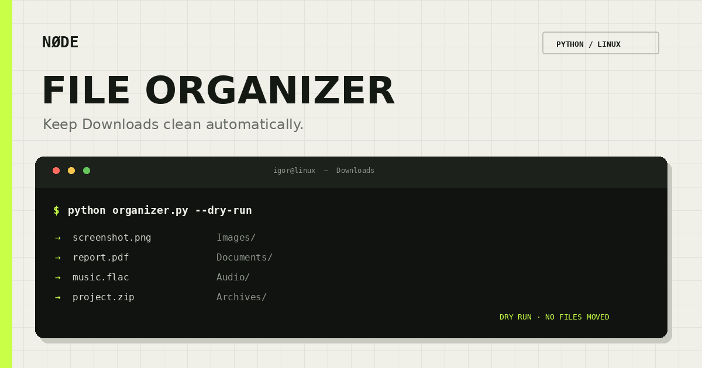

<h1 align="center">NØDE File Organizer</h1>

<p align="center">
  A simple Linux tool that keeps your Downloads folder clean automatically.
</p>

<p align="center">
  
  
  
  
</p>



The organizer watches for new files and moves them into folders like Images, Documents, Archives, Audio, Video and Code.

## Features

- Watches the Downloads folder in real time
- Sorts files by extension
- Custom folder through `.env`
- Safe duplicate names: `photo.jpg`, `photo_1.jpg`
- Ignores unfinished browser downloads
- Desktop notifications through `notify-send`
- Dry-run mode
- Undo last move
- Can run continuously with systemd
- Small test suite and GitHub Actions check

## Installation

Clone the repository:

```bash
git clone https://github.com/Igorsavchyn/node-file-organizer.git
cd node-file-organizer
```

Create a virtual environment:

```bash
python3 -m venv .venv
source .venv/bin/activate
```

Install dependencies:

```bash
pip install -r requirements.txt
```

Create the configuration file:

```bash
cp .env.example .env
```

## Configuration

Edit `.env`:

```env
WATCH_DIR=~/Downloads
DELAY=2
NOTIFICATIONS=true
HISTORY_FILE=.organizer_history.json
```

## Usage

Start watching for new downloads:

```bash
python organizer.py
```

Organize files that are already in the folder:

```bash
python organizer.py --once
```

Preview changes without moving anything:

```bash
python organizer.py --dry-run
```

Undo the last move:

```bash
python organizer.py --undo
```

Example output:

```text
✅ NØDE File Organizer запущений
Папка: /home/igor/Downloads
✅ screenshot.png → Images/screenshot.png
✅ project.zip → Archives/project.zip
```

## Run with systemd

The example service expects the project in `~/node-file-organizer`.

```bash
mkdir -p ~/.config/systemd/user
cp systemd/node-file-organizer.service ~/.config/systemd/user/
systemctl --user daemon-reload
systemctl --user enable --now node-file-organizer
```

Check the service:

```bash
systemctl --user status node-file-organizer
```

## Tests

```bash
python -m unittest discover -s tests -v
```

The organizer only moves files inside the configured folder. Use `--dry-run` first if the folder contains important files.
